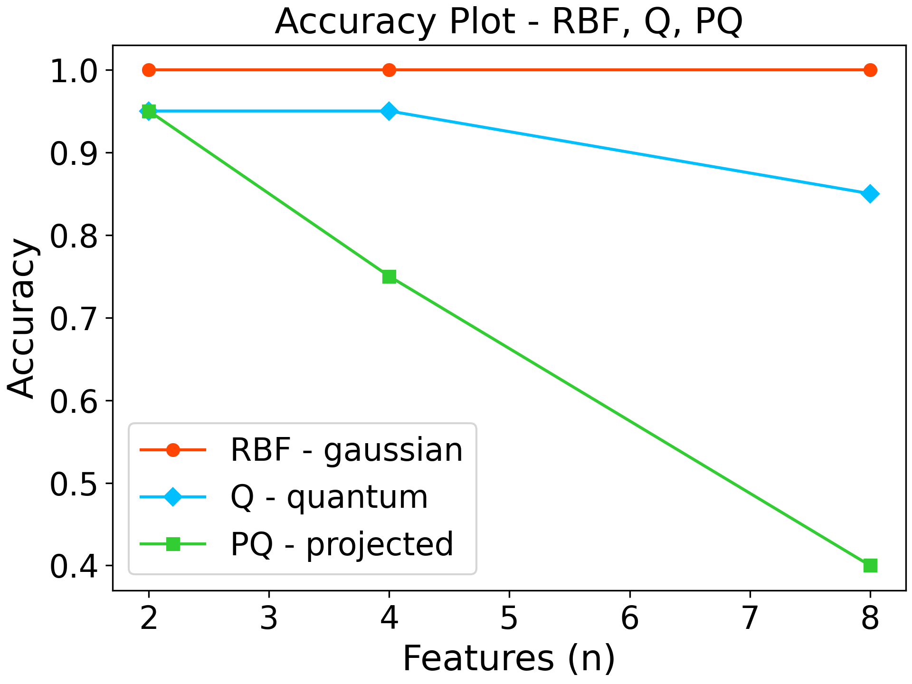
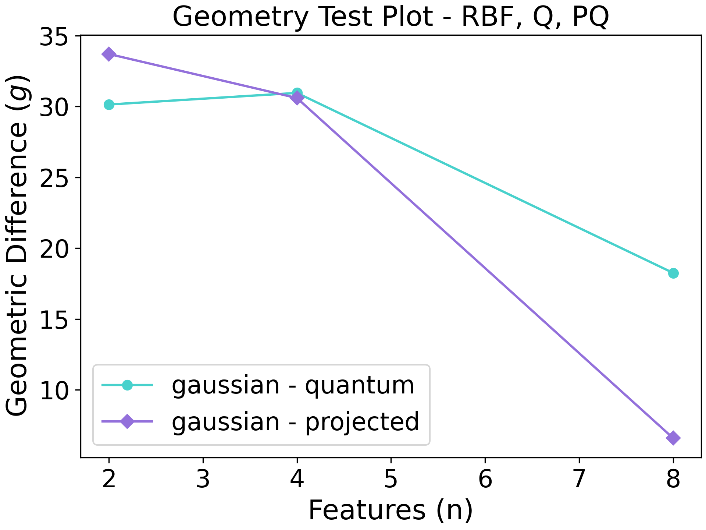

==============
How to use it
==============

Installation
==============

The software has been tested on Python 3.9.10. We recommend using this version or a newer one.

You can install the software directly from the repository using the command:

``python3 -m pip install https://github.com/CERN-IT-INNOVATION/QuASK/releases/download/1.0.0-beta/quask-1.0.0b0-py3-none-any.whl``

If the software shows dependencies related problems, download the repository and from the main directory run the command:

``python3 -m pip install -r requirements.txt``

Usage
==============
Use quask as a library of software components
--------------------------------------------------------

QuASK can be used as a library to extend your own software. Check if everything's working with:

| ``python``
| ``import numpy as np``
| ``import quask.metrics``
| ``A = np.array([[1,2], [3,4]])``
| ``B = np.array([[5,6], [7,8]])`` 
| ``print(quask.metrics.calculate_frobenius_inner_product(A, B))``

Use quask as a command-line interface tool
--------------------------------------------------------

QuASK can be used as a command-line interface to analyze the dataset with the
kernel methods. These are the commands implemented so far.

To retrieve the datasets available:

     ``python3.9 -m quask get-dataset``

To preprocess a dataset:

    ``python3.9 -m quask preprocess-dataset``

To analyze a dataset using quantum and classical kernels:

    ``python3.9 -m quask apply-kernel``

To create some plot of the property related to the generated Gram matrices:

    ``python3.9 -m quask plot-metric --metric accuracy --train-gram training_linear_kernel.npy --train-y Y_train.npy --test-gram testing_linear_kernel.npy --test-y Y_test.npy --label linear``

A complete tutorial
===================

In this tutorial we show how quask can be integrated as a library in the
researcher code. As a simple example, we take the hand-written digits MNIST
dataset from sklearn, operating some preprocessing steps on it. Thus, we
introduce quantum machine learning in our pipeline thanks to QuASK.

The libraries we need to import for this tutorial are::

    # scikit
    from sklearn import datasets
    from sklearn.model_selection import train_test_split as spl
    from sklearn.decomposition import PCA
    from sklearn.preprocessing import StandardScaler , MinMaxScaler
    from sklearn.svm import SVC # C-Support Vector Classification

    # quask packages

    from quask.template_pennylane import zz_fullentanglement_embedding, pennylane_quantum_kernel, pennylane_projected_quantum_kernel
    from quask.kernels import rbf_kernel
    from quask.metrics import calculate_generalization_accuracy, calculate_geometric_difference

    # additional packages for visualization and math
    import numpy as np
    import matplotlib as mpl
    import matplotlib.pyplot as plt
    import matplotlib.cm as cm

Let us create our dataset from scikit taking only images
with handwritten 0 and 1 so that we can develop a binary classifier::

    #data load
    digits = datasets.load_digits(n_class=2)

We define the data structure that will hold the results::

    # create lists to save the results
    gaussian_accuracy = []
    quantum_accuracy = []
    projected_accuracy = []
    quantum_gaussian = []
    projected_gaussian = []

Then this loop will test preprocess the dataset and then
try several quantum kernels, with an increasing number of qubit simulated.
The kernels are evaluated accordingly to the metrics defined in QuASK::

    # reduce dimensionality
    qubits = [2,4,8]
    for n in qubits:
        n_qubits = n
        x_tr, x_te , y_tr , y_te = spl(digits.data, digits.target, test_size = 0.2 , random_state = 22)
        pca = PCA(n_components=n_qubits).fit(x_tr)
        x_tr_reduced = pca.transform(x_tr)
        x_te_reduced = pca.transform(x_te)

        # normalize and scale

        std = StandardScaler().fit(x_tr_reduced)
        x_tr_norm = std.transform(x_tr_reduced)
        x_te_norm = std.transform(x_te_reduced)

        samples = np.append(x_tr_norm, x_te_norm, axis=0)
        minmax = MinMaxScaler((-1,1)).fit(samples)
        x_tr_norm = minmax.transform(x_tr_norm)
        x_te_norm = minmax.transform(x_te_norm)

        # select only 100 training and 20 test data

        tr_size = 100
        x_tr = x_tr_norm[:tr_size]
        y_tr = y_tr[:tr_size]

        te_size = 20
        x_te = x_te_norm[:te_size]
        y_te = y_te[:te_size]

        # compute the training kernels
        gaussian_kernel_tr = rbf_kernel(x_tr, gamma=1)
        quantum_kernel_tr = pennylane_quantum_kernel(feature_map=zz_fullentanglement_embedding, X_1=x_tr)
        projected_kernel_tr = pennylane_projected_quantum_kernel(feature_map=zz_fullentanglement_embedding, X_1=x_tr)

        # compute the testing kernels
        gaussian_kernel_te = rbf_kernel(X=x_te, Y=x_tr, gamma=1)
        quantum_kernel_te = pennylane_quantum_kernel(feature_map=zz_fullentanglement_embedding, X_1=x_te, X_2=x_tr)
        projected_kernel_te = pennylane_projected_quantum_kernel(feature_map=zz_fullentanglement_embedding, X_1=x_te, X_2=x_tr)

        # generalization accuracy
        gaussian_accuracy.append(calculate_generalization_accuracy(gaussian_kernel_tr, y_tr, gaussian_kernel_te, y_te))
        quantum_accuracy.append(calculate_generalization_accuracy(quantum_kernel_tr, y_tr, quantum_kernel_te, y_te))
        projected_accuracy.append(calculate_generalization_accuracy(projected_kernel_tr, y_tr, projected_kernel_te, y_te))
        # geometric difference
        quantum_gaussian.append(calculate_geometric_difference(quantum_kernel_tr, gaussian_kernel_tr))
        projected_gaussian.append(calculate_geometric_difference(projected_kernel_tr, gaussian_kernel_tr))

Then we plot the results::

    # plot generalization accuracy
    qubits = [2,4,8]
    fig = plt.figure(constrained_layout=True, dpi=300)
    plt.plot(qubits, gaussian_accuracy, marker='o', linestyle='-', color='orangered', label='RBF - gaussian')
    plt.plot(qubits, quantum_accuracy, marker='D', linestyle='-', color='deepskyblue', label='Q - quantum')
    plt.plot(qubits, projected_accuracy, marker='s', linestyle='-', color='limegreen', label='PQ - projected')

    plt.xlabel("Features (n)", fontsize=18)
    plt.ylabel("Accuracy", fontsize=18)
    plt.title(f"Accuracy Plot - RBF, Q, PQ", fontsize=18)
    plt.legend(fontsize=16)
    plt.tick_params(axis="both", labelsize=16)
    fig.savefig("Accuracy_digits_mnist_RBF-Q-PQ" + ".png")
    plt.close()

    fig = plt.figure(constrained_layout=True, dpi=300)
    plt.plot(qubits, quantum_gaussian, marker='o', linestyle='-', color='mediumturquoise', label='gaussian - quantum')
    plt.plot(qubits, projected_gaussian, marker='D', linestyle='-', color='mediumpurple', label='gaussian - projected')

    plt.xlabel("Features (n)", fontsize=18)
    plt.ylabel("Geometric Difference ($g$)", fontsize=18)
    plt.title(f"Geometry Test Plot - RBF, Q, PQ", fontsize=18)
    plt.legend(fontsize=16)
    plt.tick_params(axis="both", labelsize=16)
    fig.savefig("geometric_difference_digits_mnist_RBF-Q-PQ" + ".png")
    plt.close()

The figure resulting are the following ones. Here's the accuracy:

and the geometric difference:

