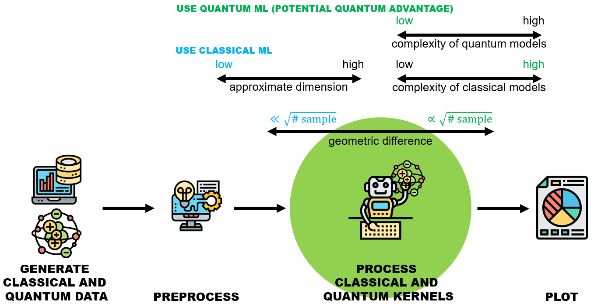

<<<<<<< HEAD
=============================================
Quantum Advantage Seeker with Kernels (QuASK)
=============================================

QuASK is an actively maintained library for constructing, studying, and benchmarking quantum 
kernel methods.

It is designed to simplify the process of choosing a quantum kernel, automate the machine 
learning pipeline at all its stages, and provide pedagogical guidance for early-stage 
researchers to utilize these tools to their full potential.

QuASK promotes the use of reusable code and is available as a library that can be seamlessly 
integrated into existing code bases. It is written in Python 3, can be easily installed using 
pip, and is accessible on PyPI.

Why *quask*?
------------

You may want to use *quask* for several compelling reasons:

- You want to implement complex features with minimal code and in a short timeframe, such as evaluating the spectral bias of a quantum kernel with the *Task Model alignment* or creating reinforcement learning agents that optimize quantum circuits to enhance classifier performance. *quask* offers a solution that requires just a few lines of code, as opposed to weeks of developmenton most quantum SDKs laking these features. 
- You want to use a high-level software API that can be seamlessly compiled to work with the most widely used quantum SDKs like Qiskit, Pennylane, Braket, Qibo, and more. This is advantageous if you prefer not to be tied to a specific hardware vendor's platform, allowing for flexibility when changing hardware. Additionally, *quask*'s modular platform enables you to easily configure custom backends to harness specific low-level features from vendors when required.
- You want a platform to learn about quantum kernels or to use the source code as a reference  implementation for theoretical constructs that lack practical details on how to build them.

Features
--------

Here it follows a comparison of the features available in *quask* compared to 
other quantum machine learning softwares:

.. list-table:: Comparison of the features of some quantum machine learning software
   :widths: 25 25 25 25
   :header-rows: 1

   * - 
     - *quask*
     - Qiskit Machine Learning
     - Pennylane
   * - Feature 1
     - V
     - X
     - X
   * - Feature 2
     - V
     - X
     - X

Acknowledgements
----------------

The platform has been developed with the contribution of 
`Massimiliano Incudini <https://incud.github.io>`__, 
Francesco Di Marcantonio, 
Davide Tezza, 
Roman Wixinger, 
Sofia Vallecorsa, 
and 
`Michele Grossi <https://scholar.google.com/citations?user=cnfcO7cAAAAJ&hl=en>`__. 

If you have used *quask* for your project, please consider `citing us <publications.html>`__.

Contents
-----------------

.. toctree::
   :maxdepth: 1
   :caption: Introduction

   getting_started
   installation

.. toctree::
   :maxdepth: 1
   :caption: Learn

   tutorials_classical/index
   tutorials_quantum/index
   tutorials_quask/index
   tutorials_applications/index

.. toctree::
   :maxdepth: 1
   :caption: Under the hood

   platform_overview
   modules

.. toctree::
   :maxdepth: 1
   :caption: About quask

   publications
   contribute
   contact_us
   changelog
   license
=======
.. QuASK documentation master file, created by
   sphinx-quickstart on Wed Jun 29 08:24:47 2022.
   You can adapt this file completely to your liking, but it should at least
   contain the root `toctree` directive.

Welcome to QuASK's documentation!
=================================
Quantum Advantage Seeker with Kernel

QuASK is a quantum machine learning software written in Python that supports researchers in designing, experimenting, and assessing different quantum and classic kernels performance. This software is package agnostic and can be integrated with all major quantum software packages (e.g. IBM Qiskit, Xanadu’s Pennylane, Amazon Braket).

QuASK guides the user through a simple preprocessing of input data, definition and calculation of quantum and classic kernels, either custom or pre-defined ones. From this evaluation the package provide an assessment about potential quantum advantage and prediction bounds on generalization error.

Beyond theoretical framing, it allows for the generation of parametric quantum kernels that can be trained using gradient-descent-based optimization, grid search, or genetic algorithms. Projected quantum kernels, an effective solution to mitigate the curse of dimensionality induced by the exponential scaling dimension of large Hilbert spaces, is also calculated. QuASK can also generate the observable values of a quantum model and use them to study the prediction capabilities of the quantum and classical kernels.
The initial release is accompanied by the journal article ["QuASK - Quantum Advantage Seeker with Kernels" available on arxiv.org] ( `https://arxiv.org/abs/2206.15284 <https://arxiv.org/abs/2206.15284>`_  ).

.. toctree::
   :maxdepth: 2
   :caption: Contents:
   
   how_to_use

Indices and tables
==================

* :ref:`genindex`
* :ref:`modindex`
* :ref:`search`
>>>>>>> origin
