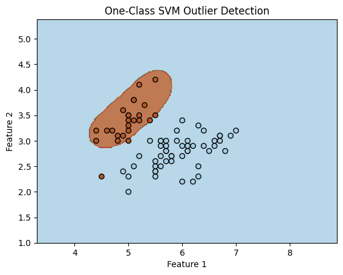

Support Vector Machines
=======================

In the previous tutorials, we have demonstrated how to solve a
regression problem using a linear regressor and established that the
training of such a model is efficient. We also pointed out that linear
regressors work best when the assumption is made that the target
function is linear. However, when such an assumption does not hold, we
can employ kernel methods to enable the linear regressor to capture
nonlinear relationships within the data.

In this tutorial, we will explore how to address a binary classification
problem using a model known as the Support Vector Machine. This model is
designed to find the optimal hyperplane that separates two classes. The
classification problem can be solved when the dataset is linearly
separable, meaning there exists a hyperplane that perfectly separates
the two classes. However, we will also examine the use of a soft margin
to accommodate slight errors in the dataset labels and the application
of kernel methods to enable non-linear classifiers.

Additionally, we will delve into using the same model for solving an
unsupervised learning problem known as anomaly detetion.

Classifying linearly-separable data: the *hard-margin SVM*
----------------------------------------------------------

Linear regression is the simplest machine learning model used for
learning a target function, denoted as :math:`f`. It requires a dataset
of samples, :math:`\{ (\mathbf{x}^j, y^j) \}_{j=1}^m`. Each feature
vector is represented as :math:`\mathbf{x}^j \in \mathbb{R}^d`, and has
been sampled i.i.d. from some unknown probability distribution
:math:`p(\mathbf{x})`. The labels are either :math:`-1` or :math:`1`,
defined as :math:`y^j`.

Suppose that the dataset is linearly separable. Then, there exists a
hyperplane :math:`\mathbf{w}^\top \mathbf{x} + b = 0`, where
:math:`\mathbf{w}` is the normal vector to the hyperplane and :math:`b`
the offset from the origin. In this case, we can define two parallel
hyperplanes such that all the elements of one class, the ones having
:math:`y^j=1`, stay in the region
:math:`\mathbf{w}^\top \mathbf{x}^j + b \ge 1` and all the others, the
ones having :math:`y^j=-1`, stay in the region
:math:`\mathbf{w}^\top \mathbf{x}^j + b \le -1`. These two conditions
can be summarized in one single inequality,

.. math:: y^j(\mathbf{w}^\top \mathbf{x}^j + b) \ge 1.

Among all the possible pairs of parallel hyperplanes, we want to choose
the best one, which is the one that maximizes the margin between the two
classes. Since the distance between the two hyperplanes is
:math:`2/\lVert \mathbf{w} \rVert`, the problem can be formulated as

.. math::

   \begin{array}{rl} 
   \arg\min_{w,b} & \langle w, w \rangle \\ 
   \text{constrained to} & y^j(\mathbf{w}^\top \mathbf{x}^j + b) \ge 1, \text{with }j = 1, ..., m
   \end{array}

Once found the weight vector :math:`\mathbf{w}`, the estimator takes the
form

.. math:: \tilde{f}(\mathbf{x}) = \mathrm{sign}(\mathbf{w}^\top \mathbf{x}^j + b).

Solving the SVM with the Lagrangian multipliers
~~~~~~~~~~~~~~~~~~~~~~~~~~~~~~~~~~~~~~~~~~~~~~~

We can solve the learning problem using the method of the Lagrangian
multipliers,

.. math:: \mathcal{L}(\mathbf{w}, \mathbf{\alpha}) = \frac{1}{2} \langle w, w \rangle - \sum_{j=1}^m \mathbf{\alpha}_j [y^j (\mathbf{x}^j \mathbf{w} + b) - 1].

We can solve the primal form of this Lagrangian,
:math:`\arg\min_{w, b} \max_{\alpha} \mathcal{L}(\mathbf{w}, \mathbf{\alpha})`,
using a quadratic optimization solve, as the objective is quadratic and
the constraint on each point forms a convex set.

We can solve the dual form of this Lagrangian,
:math:`\arg \max_{\alpha} \min_{w, b} \mathcal{L}(\mathbf{w}, \mathbf{\alpha})`.
First, calculate

.. math::

   \begin{array}{rl} 
   \frac{\partial \mathcal{L}}{\partial \mathbf{w}} = \mathbf{w} - \sum_{j=1}^m \mathbf{\alpha}_j y^j \mathbf{x}^j = 0 & \implies \mathbf{w} = \sum_{j=1}^m \mathbf{\alpha}_j y^j \mathbf{x}^j. \\
   \frac{\partial \mathcal{L}}{\partial b} = - \sum_{j=1}^m \mathbf{\alpha}_j y^j = 0 & \implies \sum_{j=1}^m \mathbf{\alpha}_j y^j = 0.
   \end{array}

Then,

.. math::

   \begin{array}{l}
   \frac{1}{2} \langle \sum_{j=1}^m \mathbf{\alpha}_j y^j \mathbf{x}^j, \sum_{k=1}^m \mathbf{\alpha}_k y^k \mathbf{x}^k \rangle - \sum_{j=1}^m \mathbf{\alpha}_j [y^j (\mathbf{x}^j (\sum_{k=1}^m \mathbf{\alpha}_k y^k \mathbf{x}^k) + b) - 1] \\
   = \frac{1}{2} \sum_{j,k=1}^m \mathbf{\alpha}_j \mathbf{\alpha}_k y^j y^k \langle \mathbf{x}^j, \mathbf{x}^k \rangle 
   - \frac{1}{2} \sum_{j,k=1}^m \mathbf{\alpha}_j \mathbf{\alpha}_k y^j y^k \langle \mathbf{x}^j, \mathbf{x}^k \rangle
   - \cancel{\sum_{j=1}^m \mathbf{\alpha}_j y^j b}
   + \sum_{j=1}^m \mathbf{\alpha}_j \\
   = - \frac{1}{2} \sum_{j,k=1}^m \mathbf{\alpha}_j \mathbf{\alpha}_k y^j y^k \langle \mathbf{x}^j, \mathbf{x}^k \rangle 
   + \sum_{j=1}^m \mathbf{\alpha}_j
   \end{array}.

Again, the solution of :math:`\alpha` can be found using a quadratic
optimization solver. You can see how to solve this, from an
implementation perspective, following `this series of
tutorial <https://github.com/Girrajjangid/Machine-Learning-from-Scratch/blob/master/Support%20Vector%20Machine/2.%20SVM%20with%20hard%20margin%20(from%20scratch).ipynb>`__.

Sparsity of the Solution
~~~~~~~~~~~~~~~~~~~~~~~~

The points lying on the hyperplanes are referred to as *support
vectors*, and they correspond to nonzero coefficients :math:`\alpha_j`.
These support vectors are the only points that contribute to the
prediction. Due to the optimization problem we have defined, which
prefers :math:`\alpha_j = 0` as the optimal situation, the solution
tends to be sparse. In other words, SVMs typically have only a few
support vectors. This characteristic enhances the efficiency of
predictions, particularly when compared to linear regression.

Allowing few errors: the *soft-margin SVM*
------------------------------------------

In situations where the data is not linearly separable or is noisy,
finding a single hyperplane that perfectly separates the two classes may
not be possible. In such cases, we can employ a classification technique
that allows for a certain degree of error. This variant of SVM is known
as the “soft-margin SVM.”

The objective function is reformulated to include a set of auxiliary
variables, often referred to as slack variables:

.. math:: \xi_j = \max(0, 1 -  y^j(\mathbf{w}^\top \mathbf{x}^j + b))

Here, for :math:`\xi_j = 0`, it indicates that the :math:`j`-th point
has been correctly classified and lies beyond its class’s margin. If
:math:`0 < \xi_j < 1`, it means the point is correctly classified but
falls between its margin and the middle hyperplane separating the two
margins. When :math:`\xi_j \ge 1`, it implies that the point is
misclassified.

:math:`C`-SVM
~~~~~~~~~~~~~

The problem can be reformulated as follows:

.. math::

   \begin{array}{rl} 
   \arg\min_{w, b, \xi \ge 0} & \langle w, w \rangle + C \sum_{j=1}^m \xi_j \\ 
   \text{subject to} & y^j(\mathbf{w}^\top \mathbf{x}^j + b) \ge 1 - \xi_j \text{ for } j = 1, ..., m
   \end{array}

Here, :math:`C` is a parameter that trades off between classification
accuracy and margin size. For :math:`C = \infty`, every error, no matter
how small, results in a solution with an infinite cost, effectively
recovering the previously mentioned “hard-margin” SVM. This formulation
can still be solved using quadratic optimization techniques. This form
is called C-SVM.

The dual form is identical to the hard-margin SVM, except for the
additional constraint :math:`0 \le \alpha_j \le C`.

:math:`\nu`-SVM
~~~~~~~~~~~~~~~

The :math:`\nu`-SVM (nu-SVM) substitutes the parameter :math:`C` with
:math:`\nu \in [0,1)`, which acts as an upper bound on the *fraction* of
margin errors and a lower bound on the fraction of support vectors.

The formulation in its primal form is:

.. math::

   \begin{array}{rl} 
   \arg\min_{w, b, \xi \ge 0, \rho>0} & \frac{1}{2} \langle w, w \rangle - \nu\rho + \frac{1}{2} \sum_{j=1}^m \xi_j \\ 
   \text{subject to} & y^j(\mathbf{w}^\top \mathbf{x}^j + b) \ge \rho - \xi_j \text{ for } j = 1, ..., m
   \end{array}

Note that :math:`\rho` substitute :math:`1` in the constraint, meaning
the margins are not distant :math:`2/\lVert w \rVert` anymore, but they
are distant :math:`2\rho/\lVert w \rVert`. The dual form is shown in
[chen05].

If the solution of the optimization problem leads to :math:`\rho > 0`,
then the :math:`\nu`-SVM is equivalent to a :math:`C`-SVM with
:math:`C = \frac{1}{m\rho}`.

Allowing non-linear boundaries: the *kernel SVM*
------------------------------------------------

Any dual formulation of the above described :math:`C`- and
:math:`\nu`-SVM can be used with kernel methods immediately.

We can create an example of a classification problem using the *iris*
dataset in *scikit-learn*, which aims to classify the three different
species of Iris by looking at the size of their petals and sepals.

.. code:: ipython3

    from sklearn.datasets import load_iris
    from sklearn.model_selection import train_test_split
    from sklearn.svm import NuSVC
    from sklearn.metrics import accuracy_score
    
    # Load the Iris dataset, pick only the first two classes
    iris = load_iris()
    X = iris.data[:100,:2] # restrict to the first two classes (first 100 elements) and only 2 features up to 4
    y = iris.target[:100]
    
    # Split the dataset into training and testing sets
    X_train, X_test, y_train, y_test = train_test_split(X, y, test_size=0.33, random_state=42)
    
    # Create and train the Nu-SVC model. We choose a two-degree polynomial kernel
    nu_svm = NuSVC(nu=0.5, kernel='poly', degree=2)
    nu_svm.fit(X_train, y_train)
    
    # Make predictions on the test set
    y_pred = nu_svm.predict(X_test)
    
    # Calculate the accuracy of the model
    accuracy = accuracy_score(y_test, y_pred)
    print(f"Accuracy: {accuracy * 100:.2f}%")

.. parsed-literal::

    Accuracy: 100.00%

It is possible also to visualize the decision boundary found by the SVM,
as it follows:

.. code:: ipython3

    import numpy as np
    import matplotlib.pyplot as plt
    
    # Create a mesh grid to plot the decision boundary
    x_min, x_max = X[:, 0].min() - 1, X[:, 0].max() + 1
    y_min, y_max = X[:, 1].min() - 1, X[:, 1].max() + 1
    xx, yy = np.meshgrid(np.arange(x_min, x_max, 0.02), np.arange(y_min, y_max, 0.02))
    
    # Get predictions for each point in the mesh grid
    Z = nu_svm.predict(np.c_[xx.ravel(), yy.ravel()])
    Z = Z.reshape(xx.shape)
    
    # Plot the decision boundary
    plt.contourf(xx, yy, Z, cmap='viridis', alpha=0.8)
    
    # Plot the data points
    plt.scatter(X[:, 0], X[:, 1], c=y, cmap='viridis', edgecolors='k')
    
    # Highlight support vectors
    plt.scatter(nu_svm.support_vectors_[:, 0], nu_svm.support_vectors_[:, 1], s=100, facecolors='none', edgecolors='red')
    
    # Set plot labels and title
    plt.xlabel('Feature 1')
    plt.ylabel('Feature 2')
    plt.title('Nu-SVM Decision Boundary')
    
    # Show the plot
    plt.show()

.. image:: output_11_0.png

Novelty and outlier detection
-----------------------------

Intro…

This kind of problem can be *unsupervised*, meaning the training usually
do not have (or do not care about) the labels. In fact, the primary form
of the optimization problem is

.. math::

   \begin{array}{rl} 
   \arg\min_{w, b, \xi \ge 0, \rho>0} & \frac{1}{2} \langle w, w \rangle - \rho + \frac{1}{\nu d} \sum_{j=1}^m \xi_j \\ 
   \text{subject to} & (\mathbf{w}^\top \mathbf{x}^j + b) \ge \rho - \xi_j \text{ for } j = 1, ..., m
   \end{array}

and all the :math:`y^j` are disappeared from the constraints.
Furthermore, :math:`d` is the dimensionality of the feature vectors.

In the literature, novelty detection and outlier detection as used as
synonyms. Sometimes, novelty detection denotes a training process for
which we train uniquely on the regular data, while outlier detection is
trained on both regular and anomalous data.

.. code:: ipython3

    import numpy as np
    import matplotlib.pyplot as plt
    from sklearn import datasets
    from sklearn.svm import OneClassSVM
    
    # Load the Iris dataset
    iris = datasets.load_iris()
    X = iris.data[:, :2]
    y = iris.target
    
    # Select the first two classes, separately
    X_1, X_2 = X[:50], X[50:100]
    y_1, y_2 = y[:50], y[50:100]
    
    # Create the training set, use only one class
    X_train = X_1[:25]
    X_test = np.row_stack([X_1[25:50], X_2[:50]])
    y_test = np.array([1] * 25 + [-1] * 50)
    print(f"{X_train.shape=} {X_test.shape=} {y_test.shape=}")
    
    # Create a One-Class SVM model for outlier detection
    one_class_svm = OneClassSVM(nu=0.1)
    one_class_svm.fit(X_train)
    
    # 1 = normal data, -1 = anomalies
    y_pred = one_class_svm.predict(X_test)
    
    # Calculate the accuracy of the model
    accuracy = accuracy_score(y_test, y_pred)
    print(f"Accuracy: {accuracy * 100:.2f}%")

.. parsed-literal::

    X_train.shape=(25, 2) X_test.shape=(75, 2) y_test.shape=(75,)
    Accuracy: 96.00%

We can also visualize the result as before. Only one point has been
misclassified.

.. code:: ipython3

    # Create a mesh grid to plot the decision boundary
    x_min, x_max = X[:, 0].min() - 1, X[:, 0].max() + 1
    y_min, y_max = X[:, 1].min() - 1, X[:, 1].max() + 1
    xx, yy = np.meshgrid(np.arange(x_min, x_max, 0.02), np.arange(y_min, y_max, 0.02))
    
    # Get predictions for each point in the mesh grid
    Z = one_class_svm.predict(np.c_[xx.ravel(), yy.ravel()])
    Z = Z.reshape(xx.shape)
    
    # Plot the decision boundary with blue and orange colors
    plt.contourf(xx, yy, Z, cmap=plt.cm.Paired, alpha=0.8)
    
    # Plot the data points
    plt.scatter(X_test[:, 0], X_test[:, 1], c=y_test, cmap=plt.cm.Paired, edgecolors='k')
    
    # Set plot labels and title
    plt.xlabel('Feature 1')
    plt.ylabel('Feature 2')
    plt.title('One-Class SVM Outlier Detection')
    
    # Show the plot
    plt.show()

References
----------

[chen05] Chen and Lin and Schölkopf. (2005). A tutorial on nu‐support
vector machines. Applied Stochastic Models in Business and Industry,
21(2), 111-136.

