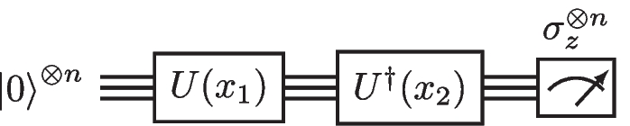
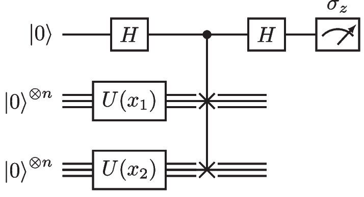

Quantum kernels
===============

.. code:: ipython3

    import sys
    import os
    # to import quask, move from docs/source/notebooks to src
    sys.path.append('../../../src')
    import quask

In this tutorial, we explore one of the paradigms of QML, the use of
*quantum algorithms* with *classical data*. The quantum kernel maps the
classical data into the Hilbert space of a quantum system, and then the
pair of encoded samples is tested via the overlap test or the swap test,
simple procedures that allow to estimate the inner products of quantum
states with a small overhead in terms of depth of the circuit.

The work in [rml14] introduced the Quantum Support Vector Machine. The
theory of quantum kernels has been first explored in [sch19] and
[hav19]. A concise, theoretical introduction to the topic is [sch21].

Parameterized quantum circuits as feature maps
----------------------------------------------

A parameterized quantum circuit, which is a function mapping a classical
vector of features :math:`\mathbf{x} \in \mathbb{R}^d` to a unitary
operator :math:`U(\mathbf{x})`, corresponds to the feature map in the
classical machine learning setting. We start the computation in the
initial state :math:`\rho_0`, which is usually the :math:`\ketbra{0}{0}`
pure density matrix, and then evolve the initial state via the
parametric unitary whose arguments correspond to the features of the
first data point,

.. math:: \rho_{\mathbf{x}} = U^\dagger(\mathbf{x}) \rho_0 U(\mathbf{x}).

The ``Operator`` class
~~~~~~~~~~~~~~~~~~~~~~

Firstly, we will see how to implement the feature map in *quask*. The
object that implements :math:`U(\cdot)` is the ``Ansatz`` class, and
each of the gates of the underlying quantum circuit is an ``Operation``.

.. code:: ipython3

    from quask.core import Operation
    import numpy as np

Any operation corresponds to a two-qubit gate in the form

.. math::

   U(\theta) = \exp\left(-i \frac{\beta \theta}{2} \sigma_1^{(p)} \sigma_2^{(q)}\right),

with :math:`\theta \in \mathbb{R}` being the single real value that
parameterizes the unitary rotation. The operation is also characterized
by its generators, :math:`\sigma_1` and :math:`\sigma_2`, the qubits on
which the operation is applied, :math:`p` and :math:`q`, and a scaling
constant :math:`\beta`.ed in great detail later.

| The parameter :math:`\theta` corresponds to one of the components of
  :math:`\mathbf{x} \in \mathbb{R}^d` and can be identified with the index
  :math:`i \in \{0, \ldots, d-1\}`. 
  In some works, you can see :math:`\theta`
  is a function of the parameters of :math:`\mathbf{x}`, e.g.
  :math:`(\mathbf{x}_1 - \pi)(\mathbf{x}_2 - \pi)`.
  This particular custom function can be used to reduce the number of qubits needed
  to embed the full feature vector :math:`\mathbf{x}`.
| We add the calculated new feature to :math:`\mathbf{x}`,
  :math:`\mathbf{x}'_d \leftarrow (\mathbf{x}_1 - \pi)(\mathbf{x}_2 - \pi)`.
  Then, :math:`\mathbf{x}' \in \mathbb{R}^{d+1}`.

Furthermore, to allow the action of constant gates, the feature of 
index :math:`i = d` corresponds to the constant :math:`1`. By fixing 
the constant feature and an arbitrary value of :math:`\beta`, one can 
define any rotational angle.

Clearly, :math:`p` and :math:`q` are in :math:`\{0, 1, \ldots, n-1\}`
where :math:`n` is the number of qubits in the quantum circuit, and
:math:`p \neq q`. Due to the design of our API, you need to always
specify the qubit on which any transformation acts, even if the
corresponding generator is the identity. This aspect, although
unnecessary at this stage, simplifies other advanced operations
available in *quask*, such as the automatic discovery of quantum
kernels.

Finally, the scaling constant :math:`0 \leq \beta \leq 1` is a
“bandwidth” and is used for different purposes. When used on a constant
gate (e.g., non-rotational, with feature index equal to :math:`d`), it
allows arbitrary rotations. When used on parameterized gates, it can
limit the “expressibility” of the feature map, an aspect that is studied
in great detail later.

.. code:: ipython3

    # Define some information about the parameterized quantum circuit
    N_FEATURES = 2
    N_QUBITS = 2
    
    # Create a random operation
    allowed_generators = Operation.PAULI_GENERATORS
    generators = np.random.choice(allowed_generators)
    
    allowed_qubits = list(range(N_QUBITS))
    wires = np.random.choice(allowed_qubits, 2, replace=False)
    
    allowed_features_plus_constant_element = list(range(N_FEATURES + 1))
    feature = np.random.choice(allowed_features_plus_constant_element)
    
    bandwidth = np.random.uniform(0.0, 1.0)
    
    operation = Operation(generators, wires, feature, bandwidth)
    print(operation)

.. parsed-literal::

    -i 0.67 * x[1] IX^(0,1)

The ``Ansatz`` class
~~~~~~~~~~~~~~~~~~~~

An ``Ansatz`` is a sequence of parameterized quantum gates. This class
wraps individual operations and performs consistency checks to ensure
the validity of each operation. To accomplish this, the Ansatz object
contains shared information about the quantum circuit, which avoids to 
repeat checks for each operation. This shared information
includes: the number of features :math:`d` in the classical data vector,
the total number of operations in the quantum circuit, and the number of
qubits in the quantum system.

By storing these details at the ``Ansatz`` level, we streamline the
management and validation of operations, ensuring coherence and
consistency within the ansatz.

.. code:: ipython3

    from quask.core import Ansatz
    N_FEATURES = 2
    N_OPERATIONS = 3
    N_QUBITS = 2
    ansatz = Ansatz(n_features=N_FEATURES, n_qubits=N_QUBITS, n_operations=N_OPERATIONS)

The ``Ansatz`` object requires to be initialized, and subsequently, each
operation, distinct from the identity transformation, needs to be
configured.

.. code:: ipython3

    ansatz.initialize_to_identity()
    
    # parameterized rotation R_{ZZ}(x_0) on the qubits 0, 1
    ansatz.change_operation(0, new_feature=0, new_wires=[0, 1], new_generator="ZZ", new_bandwidth=1.0)
    
    # parameterized rotation R_{XX}(x_1) on the qubits 0, 1
    ansatz.change_operation(1, new_feature=1, new_wires=[0, 1], new_generator="XX", new_bandwidth=1.0)
    
    # constant R_x(0.123) of the qubit 1 (the second)
    ansatz.change_operation(2, new_feature=2, new_wires=[0, 1], new_generator="IX", new_bandwidth=0.123)

Serialization of the Ansatz objects
~~~~~~~~~~~~~~~~~~~~~~~~~~~~~~~~~~~

Both Operation and Ansatz can be serialized into NumPy arrays. The
Operation is serialized into a vector of 5 elements, where a pair of
generators corresponds to a single element. The vector includes the two
qubits, the feature, and the bandwidth. The elements in the vector are
of type float. Consequently, during deserialization, certain elements
need to be transformed from float encoding back to integer encoding.

On the other hand, the ansatz is serialized into a matrix of
:math:`5 \times p` elements, where :math:`p` is the number of
operations. This serialization approach represents each operation
individually.

It’s important to note that serializing an Ansatz object at this level
results in the loss of information regarding the number of features,
operations, and qubits.

.. code:: ipython3

    vector = ansatz.to_numpy()
    print(vector)
    ansatz_back = Ansatz.from_numpy(vector, n_features=N_FEATURES, n_qubits=N_QUBITS, n_operations=N_OPERATIONS, allow_midcircuit_measurement=False)
    print(ansatz_back)

.. parsed-literal::

    [15.     0.     1.     0.     1.     5.     0.     1.     1.     1.
      1.     0.     1.     2.     0.123]
    [-i 1.00 * x[0] ZZ^(0,1), -i 1.00 * x[1] XX^(0,1), -i 0.12 * x[2] IX^(0,1)]

Decomposition of complex gates into a product of Pauli gates
~~~~~~~~~~~~~~~~~~~~~~~~~~~~~~~~~~~~~~~~~~~~~~~~~~~~~~~~~~~~

We have seen that the operation is specified in terms of Pauli matrix
generators, instead of being specified as the more commonly used quantum
gates :math:`U_3, CNOT`. The scheme we have chosen greatly help in
analyzing the *Lie algebra* associated with the parameterized quantum
circuit, which can give some insight on the functioning of the quantum
kernel, while still giving the possibility of implementing all the usual
quantum gates. In fact, any gate can be decomposed into a product of
many of the operations we have specified.

For example, the :math:`U_3(\alpha, \beta, \gamma)` quantum gates can be
defined in terms of three rotations :math:`R_Z, R_X, R_Z`. However, new
(calculated) features might be added. Another, more important example is
the CNOT gate. It allows for a similar decomposition, requiring a
:math:`R_{XX}` gate and some single qubit gates:

.. code:: ipython3

    cnot_ansatz = Ansatz(n_features=1, n_qubits=2, n_operations=13)
    cnot_ansatz.initialize_to_identity()
    # U3 with constant angles on the first qubit
    cnot_ansatz.change_operation(0, new_feature=1, new_wires=[0, 1], new_generator="ZI", new_bandwidth=3*np.pi/4)
    cnot_ansatz.change_operation(1, new_feature=1, new_wires=[0, 1], new_generator="XI", new_bandwidth=np.pi/2)
    cnot_ansatz.change_operation(2, new_feature=1, new_wires=[0, 1], new_generator="ZI", new_bandwidth=np.pi/2)
    # U3 with constant angles on the second qubit
    cnot_ansatz.change_operation(3, new_feature=1, new_wires=[0, 1], new_generator="IZ", new_bandwidth=0.0)
    cnot_ansatz.change_operation(4, new_feature=1, new_wires=[0, 1], new_generator="IX", new_bandwidth=-0.24498)
    cnot_ansatz.change_operation(5, new_feature=1, new_wires=[0, 1], new_generator="IZ", new_bandwidth=-np.pi)
    # XX
    cnot_ansatz.change_operation(6, new_feature=1, new_wires=[0, 1], new_generator="XX", new_bandwidth=np.pi/2)
    # U3 with constant angles on the first qubit (inverse of the first group)
    cnot_ansatz.change_operation(9, new_feature=1, new_wires=[0, 1], new_generator="ZI", new_bandwidth=np.pi/2)
    cnot_ansatz.change_operation(8, new_feature=1, new_wires=[0, 1], new_generator="XI", new_bandwidth=np.pi/2)
    cnot_ansatz.change_operation(7, new_feature=1, new_wires=[0, 1], new_generator="ZI", new_bandwidth=3*np.pi/4)
    # U3 with constant angles on the second qubit (inverse of the second group)
    cnot_ansatz.change_operation(12, new_feature=1, new_wires=[0, 1], new_generator="IZ", new_bandwidth=-np.pi)
    cnot_ansatz.change_operation(11, new_feature=1, new_wires=[0, 1], new_generator="IX", new_bandwidth=-1.8158)
    cnot_ansatz.change_operation(10, new_feature=1, new_wires=[0, 1], new_generator="IZ", new_bandwidth=0.0)

You can check that the transformation matches with any matrix
decomposer, such as the one bundled in Qiskit:

.. code:: ipython3

    import numpy as np 
    from qiskit.circuit.library import CXGate, RXXGate
    from qiskit.quantum_info.synthesis import TwoQubitBasisDecomposer
    
    decomposer = TwoQubitBasisDecomposer(RXXGate(np.pi / 2), basis_fidelity = 1.0, euler_basis='ZXZ')
    circ = decomposer(CXGate().to_matrix())
    circ.draw()

.. raw:: html

    <pre style="word-wrap: normal;white-space: pre;background: #fff0;line-height: 1.1;font-family: &quot;Courier New&quot;,Courier,monospace">global phase: π/4
            ┌──────────┐  ┌─────────┐┌─────────┐┌───────────┐  ┌─────────┐  »
    q0_0: ──┤ Rz(3π/4) ├──┤ Rx(π/2) ├┤ Rz(π/2) ├┤0          ├──┤ Rz(π/2) ├──»
          ┌─┴──────────┴─┐└┬────────┤└─────────┘│  Rxx(π/2) │┌─┴─────────┴─┐»
    q0_1: ┤ Rx(-0.24498) ├─┤ Rz(-π) ├───────────┤1          ├┤ Rx(-1.8158) ├»
          └──────────────┘ └────────┘           └───────────┘└─────────────┘»
    «      ┌─────────┐┌──────────┐
    «q0_0: ┤ Rx(π/2) ├┤ Rz(3π/4) ├
    «      └┬────────┤└──────────┘
    «q0_1: ─┤ Rz(-π) ├────────────
    «       └────────┘            </pre>

Clearly, if you absolute need to encode CNOTs (e.g. to replicate an
already pre-existing experiment), consider defining a function that
automatize this process.

Quantum circuits for the calculation of the inner product
---------------------------------------------------------

Once implemented the feature map via the parameterized quantum circuit
:math:`U(\cdot)`, and used such an object to encode a pair of classical
vectors :math:`\mathbf{x}, \mathbf{x}'`, we can implement a kernel
function by taking the inner product of the two vectors transformed via
the quantum operation,

.. math:: \kappa(\mathbf{x}, \mathbf{x}') = \mathrm{Trace}[\rho_{\mathbf{x}} \rho_{\mathbf{x}'}],

where the Trace function corresponds to the inner product in the Hilbert
space of density matrices :math:`\rho`.

Setup the ``Kernel`` object
~~~~~~~~~~~~~~~~~~~~~~~~~~~

One of the main advantages of *quask* is being compatible with many
different frameworks. We work with ``Kernel`` objects, which are
high-level descriptions of the operations we want to perform, and then
these descriptions are compiled into a low-level object via one of the
many quantum SDKs available.

The way *quask* manages the different implementations is via the
``KernelFactory`` object. We cannot directly instantiate ``Kernel``
objects (the class is *abstract*), instead, we use
``KernelFactory.create_kernel`` which has the exact same argument as
``Kernel.__init__``.

The role of ``KernelFactory`` is to choose the subclass of ``Kernel``,
the one that concretely implements the methods of the class on some
backend, and instantiates the object. To do that, we first have to list
all the available implementations.

.. code:: ipython3

    from quask.core import Ansatz, Kernel, KernelFactory, KernelType
    from quask.core_implementation import PennylaneKernel

The class ``PennylaneKernel`` implements the Kernel on PennyLane. It
requires all the arguments of ``Kernel`` plus some additional
information such as the name of the device we are using, and the number
of shots. We can instantiate a wrapper class that already gives all the
configurations. It follows the example that configures a noiseless
simulator with infinite shots.

.. warning::

    You need to have installed PennyLane to instantiate the class quask.core_implementation.PennylaneKernel.
    If you are using a different quantum SDK (Qiskit, Qibo, ...) you should configure directly the corresponding object (QiskitKernel, QiboKernel, ...). Look at the *backends* tutorial for more details. 

.. code:: ipython3

    def create_pennylane_noiseless(ansatz: Ansatz, measurement: str, type: KernelType):
        return PennylaneKernel(ansatz, measurement, type, device_name="default.qubit", n_shots=None)

Then, we must tell ``KernelFactory`` that there is a new implementation
that it can use to create kernels.

.. code:: ipython3

    KernelFactory.add_implementation('pennylane_noiseless', create_pennylane_noiseless)

The overlap test
~~~~~~~~~~~~~~~~

The transformation can be implemented, at the quantum circuit level, via
the *overlap test* or *fidelity test*. Such a test consists of encoding
first the data point :math:`\mathbf{x}` using :math:`U`, then the second
data point :math:`\mathbf{x}'` using :math:`U^\dagger`. When measuring
in the computational basis,

.. math:: M = \{ M_0 = \ketbra{0}{0}, M_1 = \ketbra{1}{1}, ..., M_{2^n-1} = \ketbra{2^n-1}{2^n-1} \},

the probability of observing the outcome :math:`M_0` corresponds to the
inner product. The kernel function obtained via the overlap test
corresponds to the following equation,

.. math:: \kappa(\mathbf{x}, \mathbf{x}') = \mathrm{Trace}[U^\dagger(x')U(x) \rho_0 U^\dagger(x)U(x') M_0].

To estimate the inner product with precision :math:`\varepsilon`, we
need :math:`O(1/\epsilon^2)` shots.

The corresponding quantum circuit is:

Performing the overlap test via the ``Kernel`` object
~~~~~~~~~~~~~~~~~~~~~~~~~~~~~~~~~~~~~~~~~~~~~~~~~~~~~

We can create the function that performs the overlap test using the
``Kernel`` class.

The first thing we need to do to create a kernel object is select the
backend.

.. code:: ipython3

    KernelFactory.set_current_implementation('pennylane_noiseless')

Then, we need to specify the ansatz and the kind of test we want to use
to estimate the kernel function. The overlap test corresponds to setting
a measurement parameter to “ZZ…Z” (:math:`n` times the character Z),
which means measuring in the computational basis, where each elements
belongs to the eigendecomposition of the Pauli matrix
:math:`Z \otimes Z \otimes ... \otimes Z`. Furthermore, we need to
specify the KernelType constant set to *fidelity*.

.. code:: ipython3

    kernel = KernelFactory.create_kernel(ansatz, "Z" * N_QUBITS, KernelType.FIDELITY)

It’s worth noting that the kernel object belongs to the
``quask.core.Kernel`` class. However, we did not instantiate it
directly. Instead, we utilized a ``KernelFactory`` class to create the
kernel. This approach is employed because the ``Kernel`` object deals
with the abstract structure of the quantum kernel. At a certain point,
we’ll need to convert this abstract representation into a concrete one
using one of the many quantum frameworks that handle lower-level
aspects, such as simulation and execution on quantum hardware. Prominent
examples include Qiskit, Pennylane, and Qibo.

The ``KernelFactory`` handles the low-level aspects of executing the
quantum circuit, while the ``Kernel`` class manages the high-level
aspects. By default, the ``KernelFactory`` generates a ``Kernel`` object
with a backend based on the Pennylane framework. For instructions on
setting up a different backend, please refer to the advanced *quask*
tutorials.

To calculate the kernel values, simply call the ``kappa`` method.

.. code:: ipython3

    x1 = np.random.random(size=(N_FEATURES,))
    x2 = np.random.random(size=(N_FEATURES,))
    similarity = kernel.kappa(x1, x2)
    print(f"The kernel value between {x1=} and {x2=} is {similarity:0.5f}")

.. parsed-literal::

    The kernel value between x1=array([0.47349073, 0.25305625]) and x2=array([0.8771323 , 0.71764648]) is 0.94700

Serialization of the Kernel objects
~~~~~~~~~~~~~~~~~~~~~~~~~~~~~~~~~~~

The kernel object can be serialized into a Numpy array. When
de-serializing a kernel object, the KernelFactory.create_kernel method
is invoked and the default backend of KernelFactory is chosen. The
default behavior of the KernelFactory class can be changed via the
KernelFactory API.

.. code:: ipython3

    vector = kernel.to_numpy()
    print(vector)
    kernel_back = Kernel.from_numpy(vector, n_features=N_FEATURES, n_qubits=N_QUBITS, n_operations=N_OPERATIONS, allow_midcircuit_measurement=False)
    print(kernel_back)

.. parsed-literal::

    [15.0 0.0 1.0 0.0 1.0 5.0 0.0 1.0 1.0 1.0 1.0 0.0 1.0 2.0 0.123 3 3 0]
    [-i 1.00 * x[0] ZZ^(0,1), -i 1.00 * x[1] XX^(0,1), -i 0.12 * x[2] IX^(0,1)] -> ZZ

The swap test
~~~~~~~~~~~~~

The `SWAP test <https://en.wikipedia.org/wiki/Swap_test>`__ calculates
the inner product between two states :math:`\rho_x, \rho_{x'}` using a
quantum circuit that has :math:`2n+1` qubits, :math:`n` qubits of each
state :math:`\rho`. The quantum circuit for the SWAP test is the
following one:

Only the ancilla qubit is measured, and the probability of having
outcome :math:`M_0 = \ketbra{0}{0}` is
:math:`\frac{1}{2} + \mathrm{Tr}[\rho_x \rho_{x'}]`. It is usually
preferred to use the overlap test due to the fewer qubits required.
However, the SWAP test can be easily adapted to perform a partial trace,
i.e. measuring a subset of the qubits, which will be useful in the next
tutorial.

Performing the swap test via the Kernel object
~~~~~~~~~~~~~~~~~~~~~~~~~~~~~~~~~~~~~~~~~~~~~~

The SWAP test can be constructed just as the fidelity test.

.. code:: ipython3

    from quask.core import Kernel, KernelFactory, KernelType
    swap_kernel = KernelFactory.create_kernel(ansatz, "Z" * N_QUBITS, KernelType.SWAP_TEST)
    swap_similarity = swap_kernel.kappa(x1, x2)
    print(f"The kernel value between {x1=} and {x2=} is {swap_similarity:0.5f}")

.. parsed-literal::

    The kernel value between x1=array([0.47349073, 0.25305625]) and x2=array([0.8771323 , 0.71764648]) is 0.94700

You can check that the value calculated with the SWAP test matches the
one calculated with the overlap test.

References
----------

[rml14] Rebentrost, Mohseni, Lloyd. “Quantum support vector machine for
big data classification.” Physical review letters 113 (2014): 130503

[hav19] Havlíček, Vojtěch, et al. “Supervised learning with
quantum-enhanced feature spaces.” Nature 567.7747 (2019): 209-212.

[sch19] Schuld, Maria, and Nathan Killoran. “Quantum machine learning in
feature Hilbert spaces.” Physical review letters 122.4 (2019): 040504.

[sch21] Schuld, Maria. “Supervised quantum machine learning models are
kernel methods.” arXiv preprint arXiv:2101.11020 (2021). the note.

.. note::

   Author's note.
